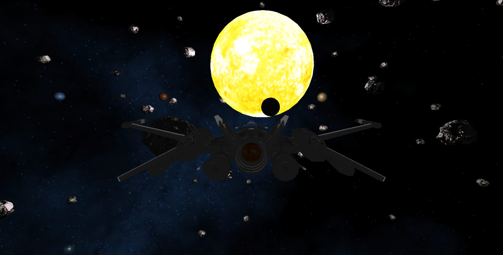
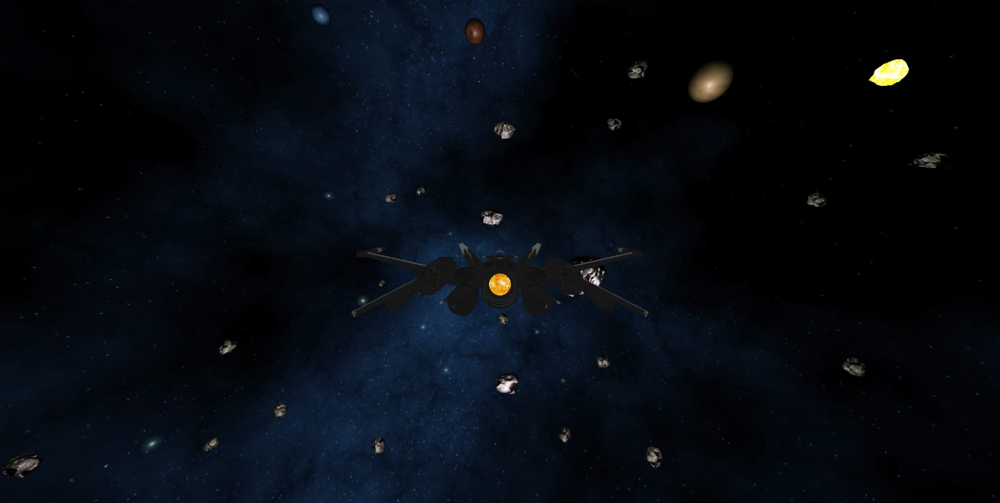
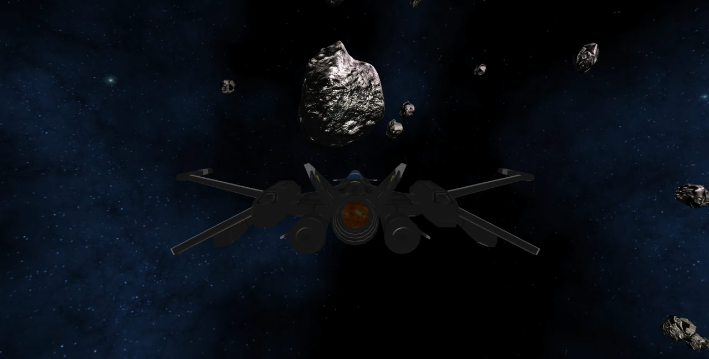
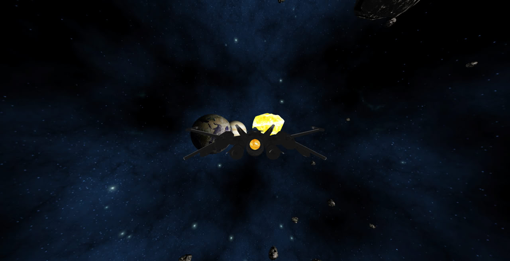

# Space Odyssey

## Table of contents
* [General info](#general-info)
* [Setup](#setup)
* [Screenshots](#screenshots)

## General info

Computer graphics project at Adam Mickewicz University.

> Equipped with a spacecraft that must be upgraded and prepared for the ultimate space exploration, your goal is to gather the maximum amount of resources, sourced from gold chunks scattered throughout space.

- `W` - pitch up
- `S` - pitch down
- `A` - yaw left
- `D` - yaw right
- `Q` - roll left
- `E` - roll right
- `R` - reload shaders
- `ESC` - exit
- `LShift` - speed up

## Setup

> The project compatible with ``Linux`` and ``Windows`` OS.

Clone dependencies before start working with project:
```bash
git submodule update --init --recursive --progress
```

Then use commands below to ``configure``, ``build`` and ``run`` project:
```bash
bash ./configure.sh
bash ./build.sh
bash ./run.sh
```

## Screenshots




