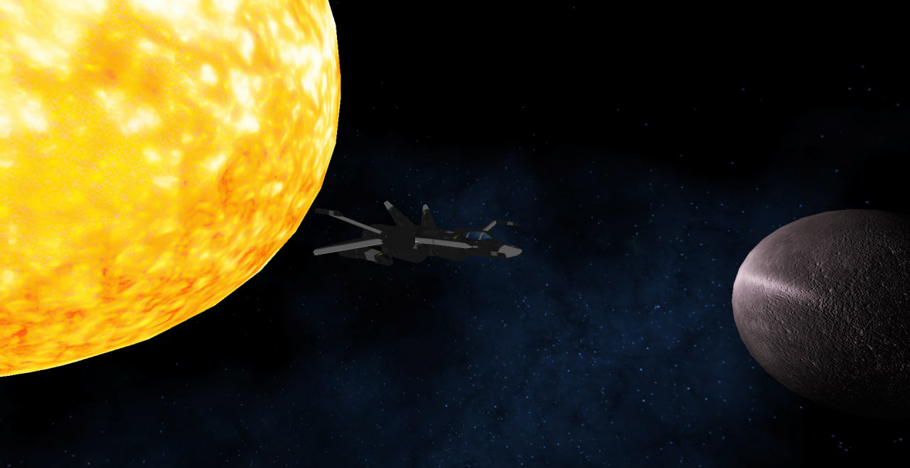
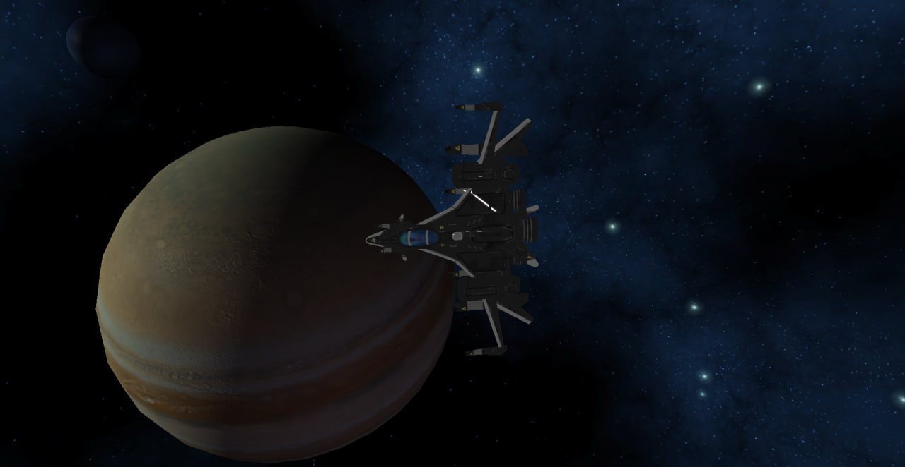
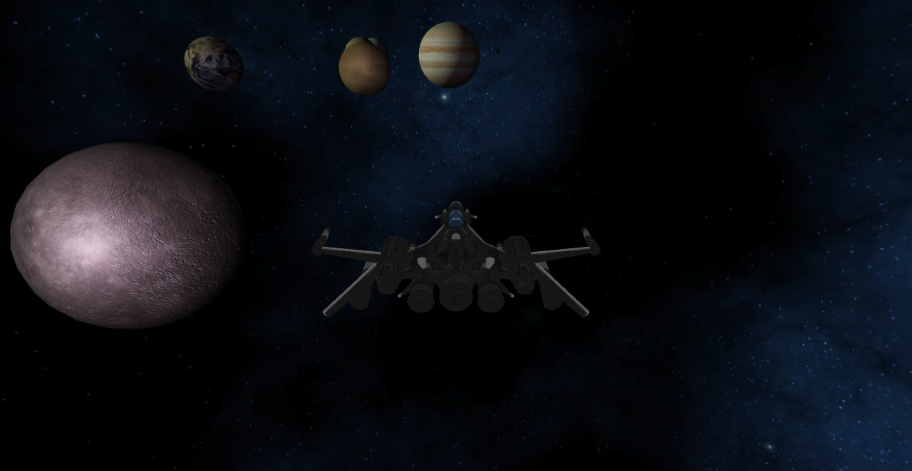
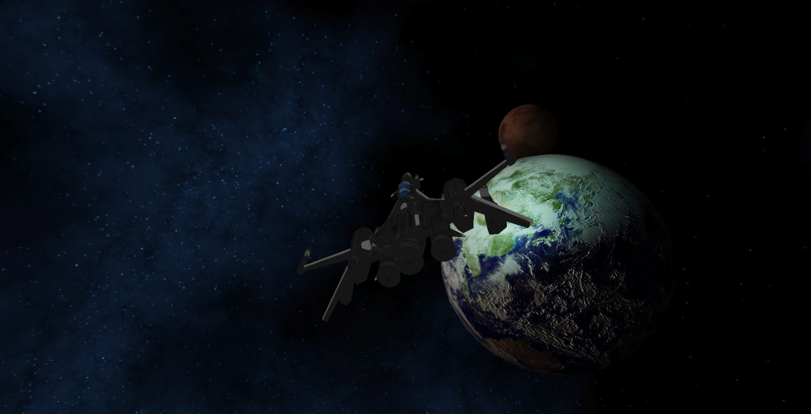
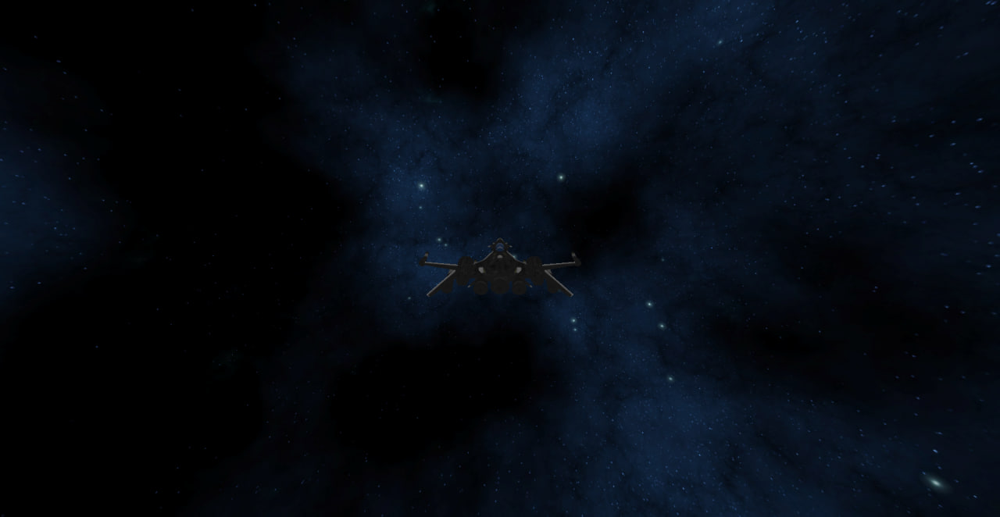
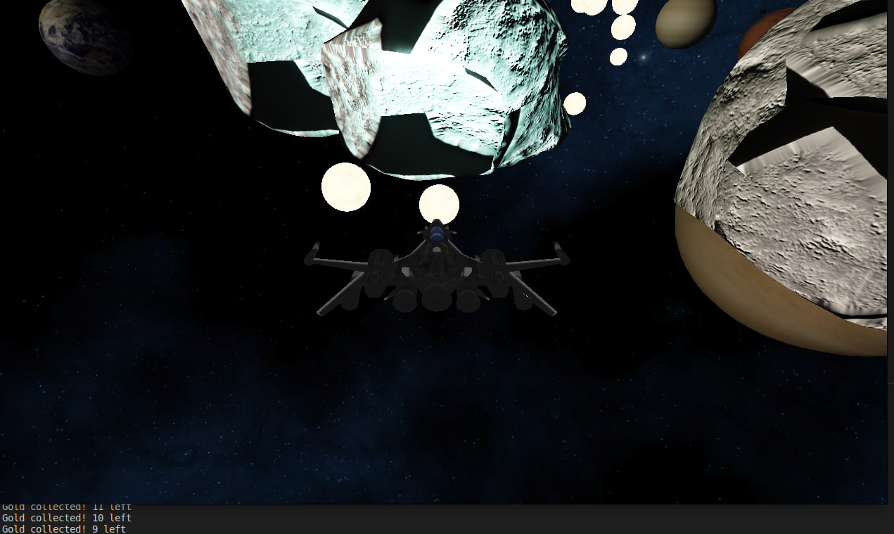

# Space Odyssey

## Table of contents
* [General info](#general-info)
* [Setup](#setup)
* [TODO](#todo)

## General info

Computer graphics project at Adam Mickewicz University.

> Equipped with a spacecraft that must be upgraded and prepared for the ultimate space exploration, your goal is to gather the maximum amount of resources, sourced from gold chunks scattered throughout space.


- `W` - speed up
- `S` - slow down
- `A` - roll left
- `D` - roll right
- `R` - reload shaders
- `L` - switch to arcball camera mode
- `ESC` - exit

## Setup

> The project compatible with ``Linux`` and ``Windows`` OS.

Clone dependencies before start working with project:
```bash
git submodule update --init --recursive --progress
```

Then use commands below to ``configure``, ``build`` and ``run`` project:
```bash
bash ./configure.sh
bash ./build.sh
bash ./run.sh
```

## TODO

- [x] Initialize project
- [x] Prepaire project to run on ``Windows``

- [x] Link libs
  - [x] `GLFW`      <br>_is an Open Source, multi-platform library for OpenGL, OpenGL ES and Vulkan development on the desktop._
  - [x] `GLEW`      <br>_is an open-source cross-platform extension loading library with thread-safe support for multiple rendering contexts and automatic code generation capability._
  - [x] `GLM`       <br>_is a C++ mathematics library for 3D software based on the OpenGL Shading Language (GLSL) specification._
  - [x] `FreeGLUT`  <br>_is a free-software/open-source alternative to the OpenGL Utility Toolkit (GLUT) library._
  - [x] `Assimp`    <br>_is a cross-platform 3D model import library which aims to provide a common application programming interface (API) for different 3D asset file formats._
  - [x] `SOIL2`     <br>_is a tiny C library used primarily for uploading textures into OpenGL._

- [x] project features
  - [x] Arcball Camera </br>
  - [x] Quaternions (Gimbal lock) </br>
  - [x] Normal mapping </br>
  - [x] Physics-based rendering (PBR) </br>
  - [x] SkyBox </br>
  - [x] Collision detection</br>